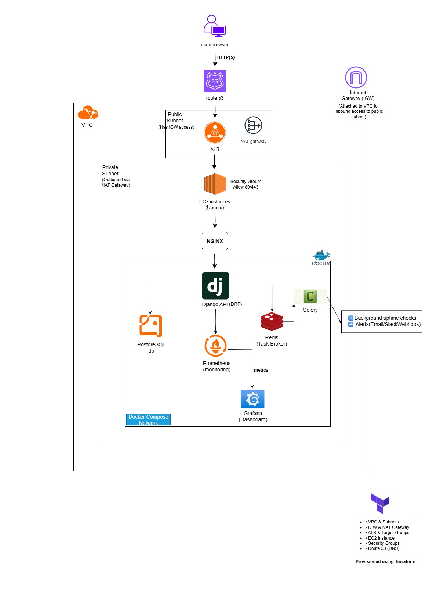

# 🩺 Uptime Monitoring Platform

A production-grade uptime and heartbeat monitoring platform built with **Django**.  
Designed to help developers and teams track website uptime, monitor background job health, and receive real-time alerts — even on the free tier.

---

## 🚧 Status

**In Development (WIP)**  
Features are being added and refined continuously. Early demos and beta access coming soon.

---

## 🌐 Vision

The platform aims to be a **DevOps-focused tool** that:

- Monitors websites, APIs, and background job health
- Detects and alerts on downtime or slow responses
- Tracks Celery/cron job heartbeats
- Provides real-time dashboards, latency metrics, and incident timelines
- Offers optional public status pages for each project or monitor
- Can scale to hundreds of users with minimal operational overhead

---

## 🔧 Tech Stack

- **Backend:** Django + Django REST Framework  
- **Worker Queue:** Celery + Redis  
- **Database:** PostgreSQL  
- **Monitoring:** Prometheus + Grafana  
- **Alerts:** Email + Webhooks (Slack, Discord, etc.)  
- **Infrastructure:** Docker + docker-compose, Terraform (for IaC)  
- **CI/CD:** GitHub Actions (build, test, deploy)  
- **Deployment:** AWS EC2, S3, ALB, Route 53, Auto Scaling Groups  
- **Frontend:** React + Tailwind CSS (MVP)

---

## 📦 Core Features


- 👤 **User** – Stores registered users, authentication info, and preferences.
- 🔁 **Website & API Uptime Checks** – monitors HTTP, TCP/port, ping  
- ⏱️ **Latency & Response Tracking** – collects metrics on response times  
- 💓 **Heartbeat Monitoring** – tracks scheduled jobs and background tasks  
- 🚨 **Alert System** – instant notifications via email, Slack, or whatsapp  
- 📊 **User Dashboards** – uptime %, latency trends, incident history  
- 🌐 **Public Status Pages** – optional, branded status pages per project  
- 📄 **Incident Timelines** – root cause and resolution tracking  
- 🔒 **Authentication & Access Control** – secure multi-user monitor management  

---

## 🗃️ System Architecture

**Architecture Overview:**  

  

---

## 🗄️ Database Models

**ER Diagram:**  


**Components:**

- **Route 53** – DNS and domain management  
- **VPC** – public subnet for ALB, private subnet for EC2 & database  
- **ALB** – distributes traffic across EC2 instances in an Auto Scaling Group  
- **EC2 Instances** – Django backend, containerized via Docker  
- **PostgreSQL** – relational database in private subnet  
- **Redis** – caching and Celery broker  
- **Prometheus + Grafana** – monitoring and dashboards  
- **S3** – logs storage with Glacier lifecycle policies  
- **Terraform** – infrastructure provisioning and management  

---

## 🛠️ Infrastructure & DevOps

- **Terraform Modules:** VPC, ALB, EC2, Security Groups, RDS, Redis, S3, Route 53  
- **Docker & docker-compose:** encapsulated services, simplified local dev environment  
- **Auto Scaling & Load Balancing:** ensures high availability  
- **CI/CD (GitHub Actions):**  
  - Linting, tests, and Docker builds  
  - Automatic deployments to development and production environments  
  - Django migrations run automatically during deploys  
- **Monitoring & Logging:**  
  - Prometheus metrics collection  
  - Grafana dashboards  
  - Log archival to S3/Glacier with lifecycle policies  
- **Security:**  
  - IAM roles for EC2 instances  
  - Least-privilege access to S3 and other AWS services  
  - Encrypted connections and secure environment management  

---

## 🧪 Installation (Local Dev / MVP)

```bash
git clone https://github.com/Dipec001/uptime-monitor.git
cd uptime-monitor
cp .env.example .env
docker-compose up --build
```

### This will spin up Django, PostgreSQL, Redis, Celery, Prometheus, Grafana, and other required services locally.

## 🔍 Data Retention Policy

- Uptimeand heartbeat logs are stored for 90 days by default.
- Minutely logs are aggregated into daily summaries after 24 hours to reduce storage and improve query performance.
- Old logs are cleaned automatically via scheduled tasks.
- S3/Glacier lifecycle policies store logs for long-term retention, minimizing cost.
- Retention periods are configurable via environment variables or Terraform variables.

## Project Structure

```
UPTIME_MONITOR/
├──.github/
    ├── workflows/
       ├── ci-cd.yml
├── monitor/           # Django app
│   ├── models.py
│   ├── views.py
│   ├── serializers.py
│   ├── urls.py
│   ├── tasks.py
│   └── utils.py
├── uptimemonitor/     # Django project
│   ├── settings.py
│   ├── urls.py
│   └── wsgi.py
├── docker-compose.yml
├── Dockerfile
├── Makefile
├── terraform/         # Terraform infrastructure code
│   ├── main.tf
│   ├── networking.tf
│   ├── compute.tf
│   ├── database.tf
│   ├── redis.tf
│   ├── s3.tf
│   └── route53.tf
├── prometheus.yml
├── grafana/
├── .env.example
├── .gitignore
├── requirements.txt
└── README.md
```

## 🧠 Future Improvements

- Full React frontend + interactive dashboards
- Enhanced incident reporting and root cause analysis  
- Role-based access controls for teams and projects  

---

## 👨‍💻 Author

**Divine Chukwu**  
• [LinkedIn](https://www.linkedin.com/in/divine-chukwu-63bb04145/) 
• [GitHub](https://github.com/Dipec001)

---

## 🪄 License

MIT License
