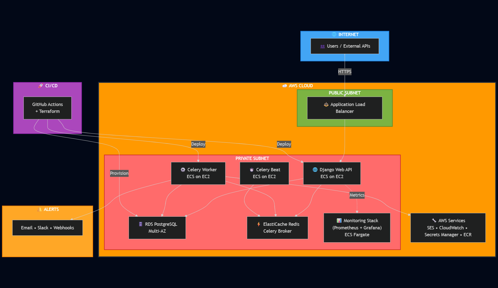
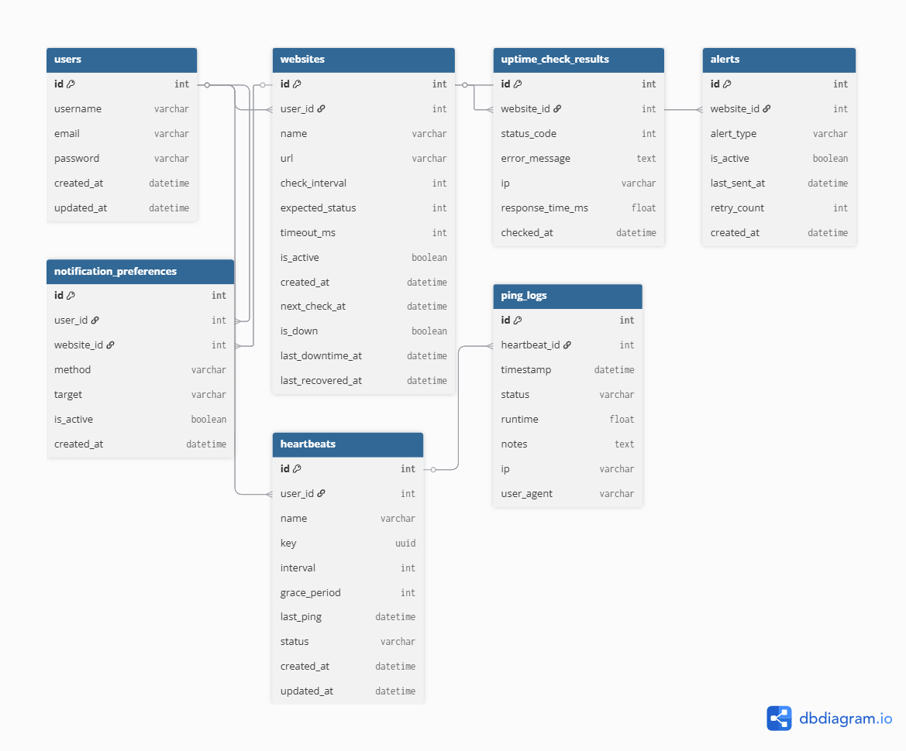
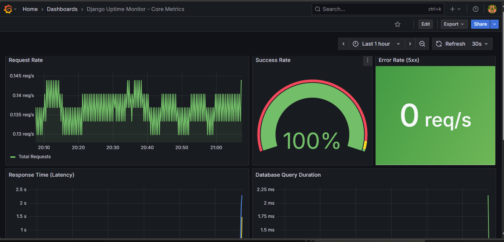

# 🩺 Uptime Monitoring Platform

A **production-grade uptime and heartbeat monitoring platform** built with Django REST Framework, designed to help developers and teams track website uptime, monitor background job health, and receive real-time alerts.

[](https://github.com/Dipec001/uptime-monitor/actions/workflows/app-cicd.yml)

[](https://github.com/Dipec001/uptime-monitor/actions/workflows/ci.yml)

[](https://github.com/Dipec001/uptime-monitor/actions/workflows/infra.yml)

[](https://github.com/Dipec001/uptime-monitor/actions/workflows/terraform-destroy.yml)

[](https://opensource.org/licenses/MIT)

---

## 🚀 Live Demo

View it Live [Here](https://alivechecks.com/)

---

## 🌟 Key Features

- ✅ **Website & API Uptime Monitoring** – HTTP/HTTPS checks with configurable intervals
- 💓 **Heartbeat Monitoring** – Track cron jobs and scheduled tasks via ping URLs
- 🚨 **Multi-Channel Alerts** – Email (AWS SES), Slack webhooks, WhatsApp
- 📊 **40+ Prometheus Metrics** – Comprehensive observability with Grafana dashboards
- ⚡ **Real-Time Dashboards** – Uptime percentages, latency trends, incident history
- 🔒 **Secure Authentication** – JWT-based auth with role-based access control
- 📈 **Performance Tracking** – Response time monitoring and historical analytics
- 🌐 **Public Status Pages** *(Coming Soon)* – Branded status pages per project
- 🔁 **Retry Logic & Throttling** – Intelligent alert management to prevent spam

---

## 🏗️ System Architecture

### Simplified Overview



### Complete Infrastructure

[**View Interactive Detailed Architecture Diagram →**](https://mermaid.live/view#pako:eNqtWN1u48YVfpUBFwnWgLyiKFF_KAJQlOS4tbOK6a6B1EExokYSa4qjDoe2ldUCLdCLog2QNAny14sgF2lvepHc5aoP0xdIHqFnZkiKFEmtClQGDM7hOd-cvznnDF9qLp0Rra8tGF4v0fXgNkDwC6OpIpwHnLCA8N_caj9_8-HH6fpWe19xit-vQ8JCyfG379Qi93r0KGSwbzMaANd_Pvo-JSFBQ7-k0_AXU1Z_6-nbBDM-JZijiRcswpMUhwSz22BPN-vGEXBf_vGnHz8SC2T7NJrltk55X0xs4IX_6GlDfyb_6o32SY45JzCJpr7nOtEUjBW2qTWKCTFKA1CMVg3JhSEXRUjxsy4GQtWvP5eqrtcAhbkHpl9QPEMD7OPAJSz2wfX1xKmL_yeSMKGMo65eb7WapdjvWNfS9599KB7RGebkAW9KWYuU1N6R7dh-FEJYDECDFYqX6OkYswWAllsmfhNGV4QvSaSS4NO_ZCjKpgRiZ1BP7-lydUk489wQOS7oAUGv3OWM4TkOsNriz8myCr-p6wr_hRdG2Pc-kP4uBZe5VSBU5QXz7mGnTGIowl5mNLOZ0TqQGSUBaOwHYGQb6AJHgQsHdLM-EIgMmHEehFxklYrJ59-JzBNAVsQpOBtcEizAiTRaV8KJ3_B3OFjQGzJNKoAiIKAga3KezdDY4fWVimhd-HFNvYAf3MAmPmGbG8ruCJNn5CuhqaIiRZawA-zeLUDdYJapF-6SuHe_fSDT0OMkrCEMUjw8OWLDARQZWYx-yGwniBL4God34KQlmUV-ci7XhHl0BjVAbnpgk0I-VRKLlKuhIx39xZ-EWrBCExryBSPOuxfK18xbYVB1iDme4pDsAmC2mobS9DLyuXdqvVeu4sjHIfdsDGZIf3-bpaArMvOUcxOfMAohQG8i-X63XbvZ6RXwc1buHaNs3XYIu_dUborCnSwLeM5IuePTf8oCD0upwGiFPR9ZMtgFGdkFbjB3l0r0rxmKlL6gixDsuaSBxykrKzkOcRmc5UuoLwuZlVBdP06oKCZLrOEAWhiZkYB72BeovyKbokoj-0rp8g_xqASpK9x6vgKoEoGxsvuTf4vHOPBJSZWxV5Fu6qczvEGgltCABvmIVwXg3LpUNn0iHtEV9YlQfUKhLXkl2ojTMHokrmCMa5M8IIIWyTYm3iiNJpHvI09aVQO9oLuFym0npbD7kDsgiHUtE7mTEqcaqbSBknKXQRCgoEfAQY-FF3KGj3cRxDpiHt_IAqlK6N-_FUcyeaFKZ9FX0OmdM5HWFwPknElFLN-nD_24haM5xLF8jFJGOVJc6L4vrutKGKDlC9FC66LPIS9Q45RfbPtQQiSgKCV5QFEvFCBsVpQTdSAWFY97wuL0lwunJaBsZEvmPpV-n-3mQOGQhQpQ3qeOD3VfnYV_qYVoPUtK7_J8NvRKukpeKfwvYmq5xM0S8xBmMXUyf0jX6Om9h0VvOzx92uf2UIp-_Qd4rttDGFnXBLoqye1y5vG3I9E81QOy3KKN14TBMEPZCtjSZ5XD58GcQXFmkcsjRhAOkQ3zeqlmb7whZ280hgApihzF0enpW1s5U25F5qg32ZFcMkyeO9eoDgNYXcxg9QyrSGTBcUUjaLGI0-1uJshsfR4kEz1draIgnm_V65RfAr0bQVup38AhIluRnmU8stfUHRKGALLNNqgy7lHw-4hERFaQsIRb_c8OGmoTiEO0qhYrCFxBOSsoXuByICZIdigAhSp2iE21sK1K7GMY82l-jESS1kVXiGlH8ceDzms8kfILP0Ccg7m3iB2RpsGuqUJDeT6FBLzHU8-HglkauMc1DQlKJ8Zt5uKg-DNdT2oK2ATFV4at6I2lbDLFZJvcJveErPl5JSZRuERiJthm2k2FZ1_Lm_roAOeesgc4Y90PsaWeTxvTm8mgUmasDF38frs35xzI-sMiuyIA04QVhtT14kq-r8EzwIOqBDhJ8y_btIore6vJcsWTQNG7eaBkhNnzbRVT0bOy5ZcYKEukgIG9OXE5maHpZqtGgVIX5Plkz6_yQyXrvp2VjDlDK7nEfFDCIceH2PuZW0IZZzwwZBwn22KshOp-Ip8GkefPxLgJCS1UuCpwDMnap0q95Ep8BI-heNIGqk4No_eeaiIvJvZrONKaXslRqIzVnPu6H8FpZHz3DuEPkAbidlJyjJ9HfCqvwjCqbMVnn4qzW8EXjzJ8AzVf3Kvmnu_3n4zHvZ6u12DagBtf_4nRNMbNUbw8ffBmfNlvrh9rLvUp6z-Zz-dZGPFpTcG0rJ4-MnYwI9PuWnkYoxIm99ktBuzYg2ZrB2ia3YExPhow970mtbQ9aA9SRLtnWMbRKmYiG8OZdntg7xzX7LV61uB_hzP-H3CZy3VqrNUx2inc2OzYaZRfC5e_B8WII7uld6yd-4xG1zxaQdEjFIzRttq9HYyud3ud492W3BwUljVodQZ2itUdGS3r6IiKUT5JXsMyx2aK0-h12kPjEI5W0xbMm2l9mNFJTVsRBpMfLLWXYodbDSr0Cm4EfXicYXZ3q90Gr0BmjYP3KF0lYuDdxVLrz7EfwipazyBlhx6Gm8aOBYY6wmw4zVzrmw0JofVfao9a_7TZ1Z8Z3VbDNPRGt2G22jVtA2Tx8bFntpum0dPNRlM3e69q2gdy28azjt5uNQyz0eh2O6bRefVfdrmg3Q)

### Architecture Highlights

- **Hybrid ECS Deployment**: EC2 for Django/Celery, Fargate for Prometheus/Grafana
- **Multi-AZ PostgreSQL (RDS)**: High availability with automated backups
- **Private Subnet Architecture**: Enhanced security with NAT gateway for outbound traffic
- **Zero-Downtime Deployments**: Rolling updates via GitHub Actions CI/CD
- **Infrastructure as Code**: 100% Terraform-managed AWS infrastructure
- **Comprehensive Observability**: 40+ Prometheus metrics with Grafana dashboards

*For detailed architecture documentation, see [ARCHITECTURE.md](ARCHITECTURE.md)*

---

## 🗄️ Database Schema

**Entity Relationship Diagram:**



### Core Entities

- **User** – Authentication, preferences, and team management
- **Website** – Monitored endpoints with check intervals and retry policies
- **Heartbeat** – Cron job monitoring with unique ping URLs
- **CheckResult** – Historical uptime data with response times
- **PingLog** – Heartbeat ping history and missed beat tracking
- **Alert** – Downtime/recovery notifications with delivery status
- **AlertChannel** – Email, Slack, WhatsApp configurations

---

## 🔧 Tech Stack

### Backend & APIs
- **Django 5.0** + **Django REST Framework** – API development and business logic
- **Celery 5.3** – Asynchronous task processing and scheduling
- **PostgreSQL 16** – Primary relational database
- **Redis 7.2** – Celery broker, caching, and session storage

### Monitoring & Observability
- **Prometheus** – Metrics collection and time-series storage
- **Grafana** – Real-time dashboards and visualization
- **AWS CloudWatch** – Centralized logging and alerting
- **EFS** – Persistent Prometheus data storage (30-day retention)

### Infrastructure & DevOps
- **Docker** + **Docker Compose** – Container orchestration
- **Terraform** – Infrastructure as Code (IaC)
- **AWS Services**:
  - **ECS (EC2 + Fargate)** – Container orchestration
  - **Application Load Balancer** – Traffic distribution
  - **RDS PostgreSQL** – Managed database (Multi-AZ)
  - **ElastiCache Redis** – Managed Redis cluster
  - **SES** – Transactional email delivery
  - **Secrets Manager** – Secure credential storage
  - **VPC** – Network isolation (public/private subnets)
- **GitHub Actions** – Automated CI/CD pipeline

### Frontend *(Coming Soon)*
- **React 18** – Modern UI framework
- **Tailwind CSS** – Utility-first styling
- **Chart.js / Recharts** – Data visualization

---

## 📊 Monitoring & Observability

### Available Metrics (40+ Custom Metrics)

| Category | Metrics | Purpose |
|----------|---------|---------|
| **Website Monitoring** | `uptime_website_checks_total`<br/>`uptime_website_response_time_seconds`<br/>`uptime_website_uptime_percentage` | Track check success rates, response times, and availability |
| **Heartbeat Monitoring** | `uptime_heartbeat_pings_total`<br/>`uptime_heartbeat_status`<br/>`uptime_heartbeat_time_since_last_ping_seconds` | Monitor cron job health and missed beats |
| **Celery Performance** | `uptime_celery_queue_length`<br/>`uptime_celery_task_duration_seconds`<br/>`uptime_celery_active_tasks` | Track task queue health and worker performance |
| **Alerts** | `uptime_alerts_sent_total`<br/>`uptime_alerts_failed_total`<br/>`uptime_alert_delivery_duration_seconds` | Monitor alert delivery success and latency |
| **Database** | `uptime_db_query_duration_seconds`<br/>`uptime_db_slow_queries_total`<br/>`uptime_db_connection_pool_size` | Track database performance and bottlenecks |
| **Business KPIs** | `uptime_active_monitors_total`<br/>`uptime_active_users_total`<br/>`uptime_api_requests_total` | Platform usage and growth metrics |

### Grafana Dashboard Preview



---

## 🚀 Quick Start (Local Development)

### Prerequisites
- **Docker** & **Docker Compose** installed
- **Python 3.11+** (if running locally without Docker)
- **PostgreSQL 14+** and **Redis 7+** (if running natively)

### Installation

```bash
# Clone the repository
git clone https://github.com/Dipec001/uptime-monitor.git
cd uptime-monitor

# Copy environment variables
cp .env.example .env

# Edit .env with your configuration
nano .env

# Start all services
docker-compose up --build
```

### Services will be available at:
- **Django API**: http://localhost:8000
- **Prometheus**: http://localhost:9090
- **Grafana**: http://localhost:3000 (admin/admin)
- **Flower (Celery Monitor)**: http://localhost:5555

### Running Migrations

```bash
# Apply database migrations
docker-compose exec web python manage.py migrate

# Create superuser
docker-compose exec web python manage.py createsuperuser
```

---

## 🔒 Security Features

- **JWT Authentication** – Secure token-based API access
- **AWS Secrets Manager** – Encrypted credential storage
- **Private Subnets** – Database and workers isolated from internet
- **Security Groups** – Least-privilege network access control
- **IAM Roles** – Fine-grained AWS service permissions
- **HTTPS/TLS** – Encrypted data in transit
- **Database Encryption** – RDS encryption at rest
- **Rate Limiting** – API endpoint protection
- **CORS Configuration** – Controlled cross-origin access

---

## 🗂️ Project Structure

```
uptime-monitor/
├── .github/
│   └── workflows/                        # GitHub Actions pipelines
│       ├── app-cicd.yml                  # Full app build, test, and deploy
│       ├── ci.yml                        # Django + frontend tests
│       ├── infra.yml                     # Terraform infrastructure apply
│       └── terraform-destroy.yml         # Staging Infrastructure teardown
│
├── monitor/                              # Django app (core uptime logic)
│   ├── admin.py                          # Admin registrations
│   ├── alerts.py                         # Slack/email alerts
│   ├── helpers.py                        # Uptime logic helpers
│   ├── metrics.py                        # Prometheus metrics
│   ├── models.py                         # Core models (Site, Check, Incident)
│   ├── oauth_utils.py                    # OAuth integration helpers
│   ├── redis_utils.py                    # Redis connection utilities
│   ├── serializers.py                    # DRF serializers
│   ├── tasks.py                          # Celery background tasks
│   ├── urls.py                           # App-level URL routing
│   ├── utils.py                          # Shared utility functions
│   ├── views.py                          # REST API endpoints
│   └── whatsapp_utils.py                 # WhatsApp flow logic
│
├── uptimemonitor/                        # Django project configuration
│   ├── settings.py                       # Settings (dev/prod via env)
│   ├── urls.py                           # Root routing
│   └── wsgi.py                           # WSGI entrypoint
│
├── frontend/                             # React (Vite) frontend
│   ├── src/                              # Frontend source code
│   ├── package.json                      # Frontend dependencies
│   └── vite.config.js                    # Build configuration
│
├── tf-infra/                             # Terraform infrastructure as code
│   ├── modules/                          # Reusable Terraform modules
│   │   ├── certificate/                  # ACM + SES
│   │   ├── ecs/                          # ECS, ALB, CloudWatch, Prometheus
│   │   ├── networking/                   # VPC, subnets, gateways
│   │   ├── rds/                          # PostgreSQL RDS
│   │   └── redis/                        # ElastiCache Redis
│   ├── prod/                             # Production environment
│   │   ├── main.tf                       # Prod config
│   │   ├── variables.tf                  # Prod variables
│   │   ├── outputs.tf                    # Prod outputs
│   │   └── prod.tfvars                   # Prod variable values
│   └── staging/                          # Staging environment
│       ├── main.tf                       # Staging config
│       ├── variables.tf                  # Staging variables
│       ├── outputs.tf                    # Staging outputs
│       └── dev.tfvars                    # Staging variable values
│
├── prometheus/                           # Prometheus custom container
│   ├── Dockerfile                        # Dockerfile for Prometheus
│   ├── entrypoint.sh                     # Custom startup script
│   ├── prometheus.yml                    # Scrape config
│   ├── alert.rules.yml                   # Alerting rules
│   └── alertmanager.yml                  # Alertmanager config
│
├── docs/                                 # Documentation and diagrams
│   ├── simplified_architecture.png        # Simplified architecture diagram
│   ├── uptime_grafana_dashboard.png       # Grafana dashboard preview
│   ├── uptime_monitor_model_new.png       # Updated data model
│   ├── uptime_monitor_model.png           # Initial data model
│   └── uptime_monitor_system_architecture.png # Full system architecture
│
├── scripts/                              # Utility scripts for setup/ops
├── docker-compose.yml                    # Local multi-container setup
├── Dockerfile                            # Django production container
├── Dockerfile.dev                        # Dev container (hot reload)
├── requirements.txt                      # Python dependencies
├── Makefile                              # Common tasks (build, deploy, etc.)
├── .env.example                          # Env variable sample
├── .flake8                               # Linting config
├── .gitignore                            # Git ignore rules
├── manage.py                             # Django management entrypoint
└── README.md                             # Project overview

```

---

## 📈 Data Retention Policy

- **Check Results**: 90 days (configurable)
- **Ping Logs**: 90 days (configurable)
- **Minutely Aggregations**: Rolled up to hourly after 24 hours
- **Hourly Aggregations**: Rolled up to daily after 7 days
- **Prometheus Metrics**: 30 days on EFS
- **CloudWatch Logs**: 7 days (cost-optimized)
- **Database Backups**: 7 daily automated snapshots

All retention periods are configurable via environment variables.

---

## 🧪 Testing

```bash
# Run all tests
docker-compose exec web pytest

# Run tests with coverage
docker-compose exec web pytest --cov=monitor --cov-report=html

# Run specific test file
docker-compose exec web pytest monitor/tests/test_models.py

# Run linting
docker-compose exec web flake8 monitor/
```

---

## 🚢 Deployment

### Automated Deployment (GitHub Actions)

Every push to `main` or `dev` triggers:
1. ✅ Run tests and linting
2. 🐳 Build Docker images
3. 📦 Push to Amazon ECR
4. 🚀 Deploy to ECS (rolling update)
5. ✔️ Health check validation

### Manual Deployment (Terraform)

```bash
cd tf-infra/prod/

# Initialize Terraform
terraform init

# Plan infrastructure changes
terraform plan -var-file="prod.tfvars"

# Apply changes
terraform apply -var-file="prod.tfvars"
```

For detailed deployment instructions, see [DEPLOYMENT.md](docs/DEPLOYMENT.md)

---

## 🔮 Roadmap

### Phase 1: MVP ✅
- [x] Django REST API
- [x] Website monitoring with HTTP checks
- [x] Heartbeat monitoring with ping URLs
- [x] Multi-channel alerts (Email, Slack, WhatsApp)
- [x] Prometheus + Grafana observability
- [x] AWS ECS deployment with Terraform

### Phase 2: Enhanced Features
- [ ] React frontend dashboard
- [ ] Public status pages
- [ ] Incident timelines and root cause tracking
- [ ] Team collaboration features
- [ ] Advanced alert routing and escalation
- [ ] SSL certificate monitoring
- [ ] Domain expiration tracking

### Phase 3: Scale & Optimize
- [ ] Multi-region deployment
- [ ] Kubernetes migration
- [ ] Advanced analytics and reporting
- [ ] Custom integrations (PagerDuty, Datadog, etc.)
- [ ] Mobile app (iOS/Android)
- [ ] API rate limiting and usage tiers

---

## 🤝 Contributing

Contributions are welcome! Please follow these steps:

1. Fork the repository
2. Create a feature branch (`git checkout -b feature/amazing-feature`)
3. Commit your changes (`git commit -m 'Add amazing feature'`)
4. Push to the branch (`git push origin feature/amazing-feature`)
5. Open a Pull Request

Please ensure:
- All tests pass (`pytest`)
- Code follows PEP 8 style guide (`flake8`)
- Commit messages are descriptive
- Documentation is updated if needed

---

## 📝 License

This project is licensed under the **MIT License** - see the [LICENSE](LICENSE) file for details.

---

## 👨‍💻 Author

**Divine Ekene-Pascal Chukwu**  
Backend & DevOps Engineer

- 🌐 Website: [buildwithdivine.xyz](https://buildwithdivine.xyz)
- 💼 LinkedIn: [divine-chukwu-63bb04145](https://www.linkedin.com/in/divine-chukwu-63bb04145/)
- 🐙 GitHub: [@Dipec001](https://github.com/Dipec001)
- 📧 Email: dpecchukwu@gmail.com

---

## 🙏 Acknowledgments

- Built with ❤️ using Django, Celery, and AWS
- Inspired by industry-leading monitoring platforms
- Special thanks to the open-source community

---

## 📞 Support

For issues, questions, or feature requests:
- 🐛 [Open an Issue](https://github.com/Dipec001/uptime-monitor/issues)
- 💬 [Discussions](https://github.com/Dipec001/uptime-monitor/discussions)
- 📧 Email: dpecchukwu@gmail.com

---

<div align="center">

**⭐ Star this repo if you find it useful! ⭐**

Built with passion by [Divine Chukwu](https://github.com/Dipec001) 🚀

</div>