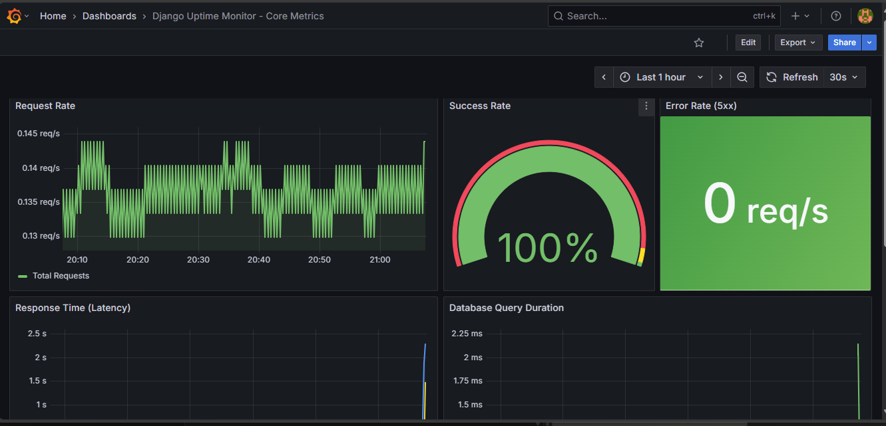

# 📊 Metrics Implementation Guide

Complete guide for instrumenting this Uptime Monitor application with Prometheus metrics.

## 📋 Table of Contents

1. [Overview](#overview)
2. [Installation](#installation)
3. [Architecture](#architecture)
4. [Available Metrics](#available-metrics)
5. [Usage Examples](#usage-examples)
6. [Grafana Dashboards](#grafana-dashboards)
7. [Troubleshooting](#troubleshooting)

---

## Overview

**Dashboard Lookalike:**  

  

This implementation provides comprehensive observability for your uptime monitoring platform, tracking:

- ✅ **Website check performance** (success rate, response time, failures)
- 💓 **Heartbeat monitoring** (pings, misses, health status)
- 🚨 **Alert delivery** (sent, failed, delivery time)
- ⚙️ **Celery tasks** (execution time, queue length, failures)
- 👥 **Business metrics** (active users, monitors per user, registrations)
- 🗄️ **Database performance** (query time, slow queries, connections)

**Key Features:**
- No separate Celery exporter needed - metrics are instrumented directly in code
- Easy-to-use decorators and context managers
- Automatic metric collection via scheduled Celery Beat tasks
- Production-ready with proper labeling and bucketing

---

## Installation

### 1. Install Dependencies

```bash
pip install django-prometheus==2.4.1 prometheus-client==0.21.0
```

### 2. Update Django Settings

```python
# settings.py
INSTALLED_APPS = [
    'monitor',
    'django_prometheus',
    # ... other apps
]

MIDDLEWARE = [
    'django_prometheus.middleware.PrometheusBeforeMiddleware',
    # ... other middleware
    'monitor.middleware.MetricsMiddleware',
    'django_prometheus.middleware.PrometheusAfterMiddleware',
]
```

### 3. Add URL Route

```python
# urls.py
urlpatterns = [
    path('', include('django_prometheus.urls')),  # /metrics/
]
```

### 4. Locally, update Docker Compose. In prod, Using ECS Fargate

Add Prometheus and Grafana services (see `metrics_config`).

---

## Architecture

```
- Services(django web, Prometheus & Grafana) all have service discovery enabled so they can easily find and get the data they need. Prometheus scraping Web and grafana using prom as data source. 
- Security groups and roles attached where appropriately too
- Also, using EFS for persistent storage for scraped data upto 30 days for now
┌─────────────────┐
│  Django App     │
│  (Port 8000)    │
│  /metrics/      │
└────────┬────────┘
         │
         │ Scrapes every 15s
         ▼
┌─────────────────┐
│  Prometheus     │
│  (Port 9090)    │
└────────┬────────┘
         │
         │ Queries
         ▼
┌─────────────────┐
│  Grafana        │
│  (Port 3000)    │
└─────────────────┘
```

**Metric Collection Flow:**

1. **Real-time metrics**: Recorded as events happen (checks, alerts, API requests)
2. **Periodic metrics**: Collected by Celery Beat tasks (queue length, uptime %, business stats)
3. **Django-prometheus**: Auto-collects HTTP, DB, and process metrics
4. **Prometheus**: Scrapes `/metrics/` endpoint every 15 seconds
5. **Grafana**: Visualizes metrics with dashboards, also using grafana alerts for now. Will switch to Alertmanager later

---

## Available Metrics

### 🌐 Website Monitoring

| Metric | Type | Description | Labels |
|--------|------|-------------|--------|
| `uptime_website_checks_total` | Counter | Total checks performed | monitor_id, monitor_name, status |
| `uptime_website_check_duration_seconds` | Histogram | Check execution time | monitor_id, monitor_name |
| `uptime_website_response_time_seconds` | Histogram | HTTP response time | monitor_id, monitor_name, status_code |
| `uptime_website_status` | Gauge | Current status (1=up, 0=down) | monitor_id, monitor_name, url |
| `uptime_website_consecutive_failures` | Gauge | Consecutive failure count | monitor_id, monitor_name |
| `uptime_website_uptime_percentage` | Gauge | 24h uptime percentage | monitor_id, monitor_name |

### 💓 Heartbeat Monitoring

| Metric | Type | Description | Labels |
|--------|------|-------------|--------|
| `uptime_heartbeat_pings_total` | Counter | Total pings received | heartbeat_id, heartbeat_name, status |
| `uptime_heartbeat_missed_total` | Counter | Total missed heartbeats | heartbeat_id, heartbeat_name |
| `uptime_heartbeat_status` | Gauge | Current status (1=healthy, 0=missed) | heartbeat_id, heartbeat_name |
| `uptime_heartbeat_last_ping_timestamp` | Gauge | Last ping timestamp (Unix) | heartbeat_id, heartbeat_name |
| `uptime_heartbeat_time_since_last_ping_seconds` | Gauge | Seconds since last ping | heartbeat_id, heartbeat_name |

### 🚨 Downtime & Recovery

| Metric | Type | Description | Labels |
|--------|------|-------------|--------|
| `uptime_downtime_events_total` | Counter | Downtime events detected | monitor_id, monitor_name, monitor_type, reason |
| `uptime_recovery_events_total` | Counter | Recovery events | monitor_id, monitor_name, monitor_type |
| `uptime_downtime_duration_seconds` | Histogram | Downtime duration | monitor_id, monitor_name |

### 📧 Alerts

| Metric | Type | Description | Labels |
|--------|------|-------------|--------|
| `uptime_alerts_sent_total` | Counter | Total alerts sent | alert_type, channel, status |
| `uptime_alerts_failed_total` | Counter | Failed alert deliveries | alert_type, channel, error_type |
| `uptime_alert_delivery_duration_seconds` | Histogram | Alert delivery time | alert_type, channel |
| `uptime_alert_retry_attempts_total` | Counter | Alert retry attempts | alert_type, channel |

### ⚙️ Celery Tasks

| Metric | Type | Description | Labels |
|--------|------|-------------|--------|
| `uptime_celery_task_duration_seconds` | Histogram | Task execution time | task_name, status |
| `uptime_celery_task_total` | Counter | Total tasks executed | task_name, status |
| `uptime_celery_queue_length` | Gauge | Tasks waiting in queue | queue_name |
| `uptime_celery_active_tasks` | Gauge | Tasks being processed | queue_name |
| `uptime_celery_worker_pool_size` | Gauge | Available workers | worker_name |

### 👥 Business Metrics

| Metric | Type | Description | Labels |
|--------|------|-------------|--------|
| `uptime_active_monitors_total` | Gauge | Active monitors | monitor_type |
| `uptime_active_users_total` | Gauge | Active users | - |
| `uptime_monitors_per_user` | Gauge | Monitors per user | user_id, username |
| `uptime_user_registrations_total` | Counter | Total registrations | - |
| `uptime_api_requests_total` | Counter | API requests | endpoint, method, status_code |
| `uptime_api_auth_attempts_total` | Counter | Auth attempts | status |

### 🗄️ Database

| Metric | Type | Description | Labels |
|--------|------|-------------|--------|
| `uptime_db_query_duration_seconds` | Histogram | Query execution time | model, operation |
| `uptime_db_slow_queries_total` | Counter | Slow queries (>100ms) | model, operation |
| `uptime_db_connection_pool_size` | Gauge | Connection pool stats | state |

---
With all the above, I have eyes on everything haha 😎

## Usage Examples

### 1. Track Website Check

```python
from monitor.helpers import track_website_check

with track_website_check(str(website.id), website.name) as tracker:
    response = requests.get(website.url, timeout=30)
    tracker.record_success(
        response.elapsed.total_seconds(),
        response.status_code
    )
```

### 2. Record Heartbeat Ping

```python
from monitor.helpers import record_heartbeat_ping

record_heartbeat_ping(
    str(heartbeat.id),
    heartbeat.name,
    is_on_time=True
)
```

### 3. Track Alert Delivery

```python
from monitor.helpers import track_alert_delivery

with track_alert_delivery('downtime', 'email') as tracker:
    send_email(...)
    tracker.success()
    
    # Or on failure:
    # tracker.failure('smtp_error')
```

### 4. Track Celery Task

```python
from monitor.helpers import track_celery_task

@celery_app.task
@track_celery_task
def my_task():
    # Your task logic
    pass
```

### 5. Track Database Queries

```python
from monitor.helpers import track_db_query

with track_db_query('Website', 'select'):
    websites = Website.objects.filter(is_active=True)
```

### 6. Record Downtime/Recovery

```python
from monitor.helpers import (
    record_downtime_event,
    record_recovery_event,
    record_downtime_duration
)

# On downtime
record_downtime_event(
    str(website.id),
    website.name,
    'website',
    'connection_timeout'
)

# On recovery
record_recovery_event(
    str(website.id),
    website.name,
    'website'
)

# Record duration
record_downtime_duration(
    str(website.id),
    website.name,
    3600.0  # 1 hour in seconds
)
```

---

## Grafana Dashboards

### Dashboard 1: Business Overview

**Panels:**

1. **Active Monitors** (Gauge)
```promql
uptime_active_monitors_total
```

2. **Overall Success Rate** (Graph)
```promql
(
  sum(rate(uptime_website_checks_total{status="success"}[5m]))
  /
  sum(rate(uptime_website_checks_total[5m]))
) * 100
```

3. **Downtime Events (24h)** (Stat)
```promql
increase(uptime_downtime_events_total[24h])
```

4. **Alert Success Rate** (Graph)
```promql
(
  sum(rate(uptime_alerts_sent_total{status="success"}[5m]))
  /
  sum(rate(uptime_alerts_sent_total[5m]))
) * 100
```

5. **Active Users** (Gauge)
```promql
uptime_active_users_total
```

### Dashboard 2: Monitor Health

**Panels:**

1. **Monitor Status** (Table)
```promql
uptime_website_status
```

2. **Average Response Time** (Graph)
```promql
avg by (monitor_name) (
  rate(uptime_website_response_time_seconds_sum[5m])
  /
  rate(uptime_website_response_time_seconds_count[5m])
)
```

3. **Top 10 Slowest Monitors** (Table)
```promql
topk(10,
  avg_over_time(uptime_website_response_time_seconds_sum[1h])
  /
  avg_over_time(uptime_website_response_time_seconds_count[1h])
)
```

4. **Check Success Rate by Monitor** (Heatmap)
```promql
sum by (monitor_name) (
  rate(uptime_website_checks_total{status="success"}[5m])
)
/
sum by (monitor_name) (
  rate(uptime_website_checks_total[5m])
)
```

5. **Consecutive Failures** (Graph)
```promql
uptime_website_consecutive_failures > 0
```

### Dashboard 3: Alert Performance

**Panels:**

1. **Alerts Sent by Channel** (Pie Chart)
```promql
sum by (channel) (increase(uptime_alerts_sent_total[24h]))
```

2. **Alert Delivery Time (p95)** (Graph)
```promql
histogram_quantile(0.95,
  rate(uptime_alert_delivery_duration_seconds_bucket[5m])
)
```

3. **Failed Alerts** (Table)
```promql
sum by (alert_type, channel, error_type) (
  increase(uptime_alerts_failed_total[1h])
)
```

4. **Alert Retry Rate** (Graph)
```promql
rate(uptime_alert_retry_attempts_total[5m])
```

### Dashboard 4: Celery Performance

**Panels:**

1. **Queue Length** (Graph)
```promql
uptime_celery_queue_length
```

2. **Task Execution Time (p50, p95, p99)** (Graph)
```promql
# p50
histogram_quantile(0.50, rate(uptime_celery_task_duration_seconds_bucket[5m]))

# p95
histogram_quantile(0.95, rate(uptime_celery_task_duration_seconds_bucket[5m]))

# p99
histogram_quantile(0.99, rate(uptime_celery_task_duration_seconds_bucket[5m]))
```

3. **Task Success Rate** (Graph)
```promql
sum by (task_name) (
  rate(uptime_celery_task_total{status="success"}[5m])
)
/
sum by (task_name) (
  rate(uptime_celery_task_total[5m])
)
```

4. **Active Tasks** (Gauge)
```promql
uptime_celery_active_tasks
```

5. **Worker Pool Size** (Gauge)
```promql
uptime_celery_worker_pool_size
```

### Dashboard 5: Database Performance

**Panels:**

1. **Query Duration (p95)** (Graph)
```promql
histogram_quantile(0.95,
  rate(uptime_db_query_duration_seconds_bucket[5m])
)
```

2. **Slow Queries Rate** (Graph)
```promql
rate(uptime_db_slow_queries_total[5m])
```

3. **Connection Pool** (Graph)
```promql
uptime_db_connection_pool_size
```

---

## Troubleshooting

### Issue: Metrics endpoint returns empty or old data

**Solution:**
```bash
# Restart Django
docker-compose restart web

# Check metrics endpoint
curl http://localhost:8000/metrics/ | grep uptime_
```
In Prod, Force redeploy
```bash

### Issue: Celery queue length always shows 0

**Problem:** Need to read directly from Redis

**Solution:**
```python
# In your code
from monitor.helpers import get_redis_queue_length
import redis

redis_client = redis.from_url(settings.CELERY_BROKER_URL)
get_redis_queue_length(redis_client, 'celery')
```

### Issue: Grafana shows "No data"

**Checklist:**
1. Verify Prometheus is scraping: `http://localhost:9090/targets`
2. Check metrics exist: `http://localhost:8000/metrics/`
3. Verify query syntax in Prometheus: `http://localhost:9090/graph`
4. Check Grafana datasource connection
5. Ensure time range includes data

### Issue: High cardinality warnings

**Problem:** Too many unique label combinations

**Solution:**
- Don't use user IDs in labels unless necessary
- Use `monitor_id` instead of `monitor_name` where possible
- Aggregate metrics before storing

### Issue: Metrics collection tasks not running

**Solution:**
```bash
# Check Celery Beat is running
docker-compose logs beat

# Verify beat schedule
python manage.py shell
>>> from celery import current_app
>>> print(current_app.conf.beat_schedule)

# Manually trigger
python manage.py shell
>>> from monitor.tasks import collect_business_metrics
>>> collect_business_metrics.delay()
```

---

## Best Practices

### 1. Label Naming
- Use snake_case
- Keep labels low cardinality
- Be consistent across metrics

### 2. Metric Naming
- Use `_total` suffix for counters
- Use `_seconds` suffix for durations
- Use descriptive names

### 3. Performance
- Don't track metrics in hot paths without caching
- Use sampling for high-frequency events
- Keep histogram buckets reasonable

### 4. Alerting
- Set up Prometheus alerts for critical metrics
- Alert on rate of change, not absolute values
- Use appropriate time windows

### 5. Documentation
- Document what each metric measures
- Keep a registry of all custom metrics
- Update dashboards when adding new metrics

---

## Testing Metrics

```python
# Test in Django shell
python manage.py shell

from monitor.helpers import *

# Test website check
with track_website_check('123', 'TestSite') as tracker:
    tracker.record_success(0.5, 200)

# Test alert delivery
with track_alert_delivery('downtime', 'email') as tracker:
    tracker.success()

# View metrics
from prometheus_client import generate_latest
print(generate_latest().decode('utf-8'))
```

---

## Quick Reference

### Start Services
```bash
docker-compose up -d
```

### View Metrics
```bash
curl http://localhost:8000/metrics/ | grep uptime_
```

### Access UIs
- Django: http://localhost:8000
- Prometheus: http://localhost:9090
- Grafana: http://localhost:3000 (admin/admin)

### Useful Commands
```bash
# Check Prometheus targets
curl http://localhost:9090/api/v1/targets

# Query Prometheus
curl 'http://localhost:9090/api/v1/query?query=uptime_website_checks_total'

# Reload Prometheus config
curl -X POST http://localhost:9090/-/reload
```